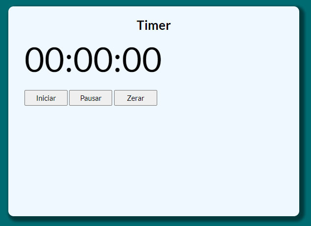

# simple-timer-exercise
### A JavaScript solution for a basic exercise consisting in a simple timer with three buttons: Start, Pause and Stop

Exercise proposed by Professor Luiz Otávio Miranda in JavaScript/TypeScript course, consistin in a basic timer using strictly and pure JavaScript, without using any other libraries or fancy tools, which i came with a clever and interesting solution.

---

Exercício proposto pelo Professor Luiz Otávio Miranda no curso de JavaScript/TypeScript, consistindo em um cronômetro básico usando estritamente e puro JavaScript, sem o uso de outras bibliotecas ou ferramentas sofisticadas, na qual cheguei a uma solução inteligente e interessante.

